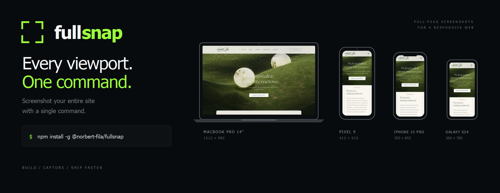

<p align="center">
  
</p>

# Fullsnap 📸

[](https://www.npmjs.com/package/@norbert-fila/fullsnap)

**Fullsnap** is an automated visual inspection CLI tool for developers. It captures full-page, layout-stable screenshots of any website across multiple device viewports simultaneously.

It is designed to eliminate the manual work of checking responsive designs.

## Installation

You can install Fullsnap globally using npm:

```bash
npm install -g @norbert-fila/fullsnap
```

*Note: You do not need to install browser binaries manually. Fullsnap handles everything under the hood using Playwright.*

## Quick Start

### 1. Initialize Configuration
Run the setup wizard in your project folder to generate a default configuration file:

```bash
fullsnap init
```
This command lets you interactively select the target devices (e.g., iPhone 15 Pro, MacBook Pro 14, Galaxy S24) and sets up your `fullsnap.config.js`.

### 2. Capture a Website
Run the tool against any live URL or local development server:

```bash
fullsnap https://norbertfila.com
```

All screenshots will be saved automatically in a timestamped folder (e.g., `./screenshots/norbertfila_com/2026-09-15_12-00-00/`).

### 3. CLI Options

Use command-line options to control which devices are captured without changing your configuration file:

```bash
fullsnap <url> [options]
```

| Option | Description |
| --- | --- |
| `-a, --all` | Capture all available devices. |
| `-d, --devices <list>` | Capture only the selected devices. Use a comma-separated list of device IDs. |
| `-c, --custom-device <spec>` | Capture a custom viewport using `name=widthxheight`. Repeat the option to define multiple custom devices. |
| `-h, --help` | Show the CLI help. |
| `-V, --version` | Show the installed Fullsnap version. |

Examples:

```bash
# Capture every available device
fullsnap https://norbertfila.com --all

# Capture only an iPhone and a desktop viewport
fullsnap https://norbertfila.com --devices "iphone-14,desktop-1920"

# The short forms are also supported
fullsnap https://norbertfila.com -d "iphone-15-pro,macbook-pro-14"

# Capture a custom viewport
fullsnap https://norbertfila.com --custom-device "tablet=768x1024"

# Capture built-in and custom viewports together
fullsnap https://norbertfila.com --devices "iphone-14,desktop-1920" \
  --custom-device "tablet=768x1024" \
  --custom-device "wide-monitor=3440x1440"
```

`--all` takes precedence over `--devices` when both options are provided. If no device option is specified, Fullsnap uses the devices from `fullsnap.config.js`.

Custom devices are added to the selected built-in devices. If a custom device is the only device option, only the custom device is captured. The name may contain letters, numbers, `_` and `-`, and the width and height must be positive integers. Custom devices use a generic desktop browser profile with a device scale factor of `1`.

Available device IDs:

```text
iphone-se, iphone-14, iphone-15-pro, iphone-14-pro-max, iphone-16-pro-max
pixel-9, galaxy-s24, pixel-7a, android-small
laptop-1366, macbook-pro-14, desktop-1920, desktop-2560
```

To see the same information directly in the terminal, run:

```bash
fullsnap --help
```

## Key Features

- **Smart Stabilization:** Automatically waits for images to load and freezes CSS animations/transitions to guarantee pixel-perfect, deterministic screenshots.
- **Local Dev Server Detection:** If you test a local URL (e.g., `http://localhost:3000`), Fullsnap automatically pings the port and waits for your dev server to start before capturing.
- **Real Device Viewports:** Test against accurate screen sizes and pixel densities for well known Apple, Android, and Desktop devices.
- **Concurrency Control:** Run multiple browser tabs in parallel to speed up the capture process.

## Configuration

You can customize Fullsnap by editing the `fullsnap.config.js` file generated by the `init` command:

```javascript
export default {
  devices: [
    'desktop-1920',
    'macbook-pro-14',
    'iphone-15-pro',
    'galaxy-s24'
  ],
  capture: {
    format: 'png',
    animations: 'disable', // Instantly freezes CSS transitions for stable captures
    concurrency: 2
  },
  output: './screenshots'
};
```

## Links

- **NPM Package:** [npmjs.com/package/@norbert-fila/fullsnap](https://www.npmjs.com/package/@norbert-fila/fullsnap)
